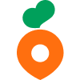
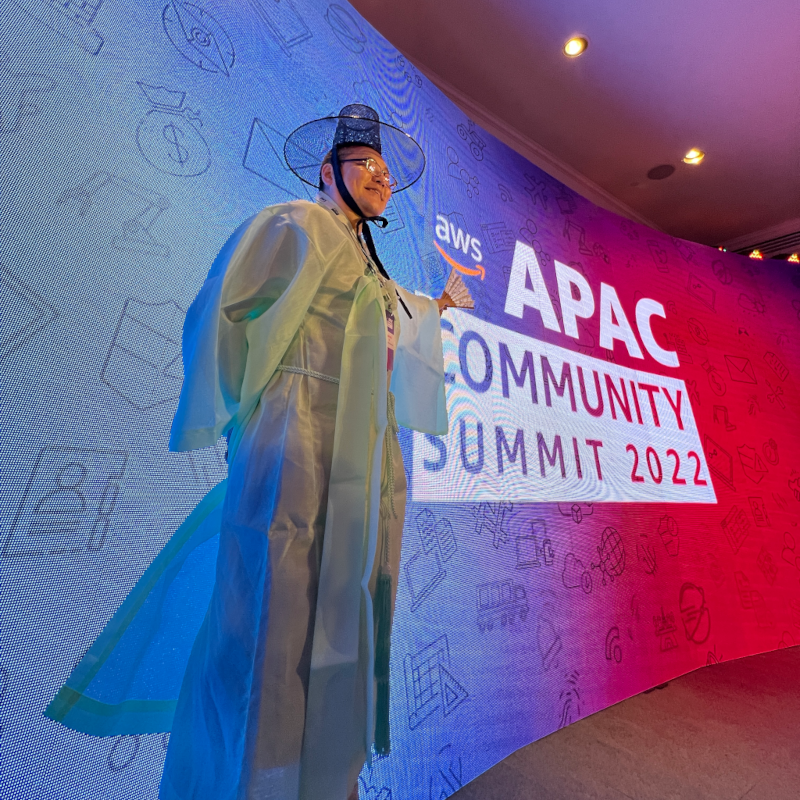

<SectionLabel section="ABOUT ME" />

유정열

(nalbam, bruce)

당근마켓 SRE

AWS AI Hero

<PageFooter />

<!--
**[ABOUT ME · 약 1분]**

이름은 유정열입니다. 닉네임은 nalbam — 새벽이라는 뜻이에요.
새벽에 코딩하는 걸 좋아해서 그렇게 지었습니다.

지금은 두 가지 일을 동시에 하고 있어요.
- 하나는 **당근에서 SRE라는 엔지니어** 로 일하는 것
- 또 하나는 **AWS AI Hero** 활동

이 두 가지가 뭔지는 다음 장에서 하나씩 풀어드릴 거예요.

→ 다음 슬라이드 전환: "제가 어떤 사람인지, 좀 더 풀어서 말씀드릴게요."
-->
