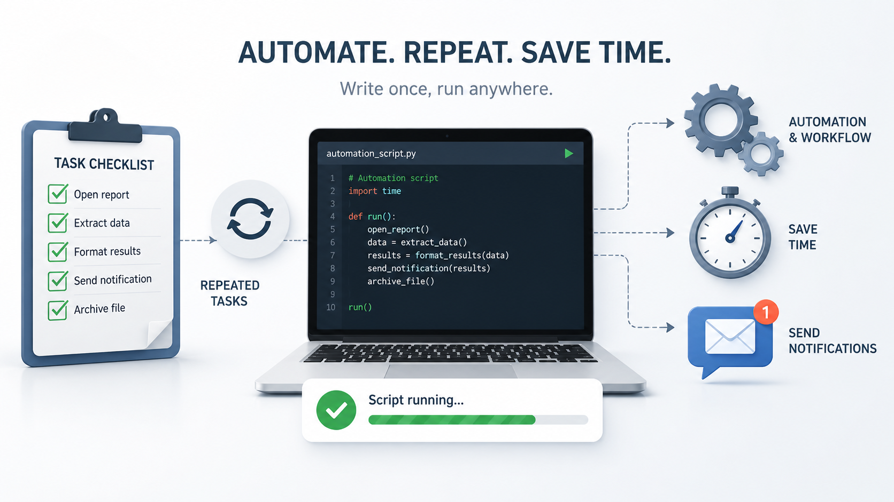

<SectionLabel section="FUNDAMENTALS" />

프로그래머의 기본

반복된 일의 자동화

매번 같은 일을 사람 손으로 하고 있다면 그건 <strong class="text-white">코드를 써 볼 좋은 신호</strong>입니다

👀

계속 확인해야 한다

🖱️

계속 눌러야 한다

📝

계속 기록해야 한다

🤔

자주 잊어버린다

⚠️

사람이 하면 실수한다

이런 신호가 보이면 — 자동화를 떠올려 보세요

<PageFooter />

<!--
**[반복된 일의 자동화 · 약 1분 30초]**

프로그래머의 기본은 — 한 마디로 **반복된 일의 자동화** 입니다.

매번 같은 일을 사람 손으로 하고 있다면 —
그게 바로 **코드를 써볼 좋은 신호** 예요.

어떤 게 신호일까요?
- 계속 확인해야 한다
- 계속 눌러야 한다
- 계속 기록해야 한다
- 자주 잊어버린다
- 사람이 하면 실수한다

이 다섯 가지 중에 하나라도 보이면 — '아 이거 자동화할 수 있겠는데?' 라고 떠올려 보세요.
안 만드셔도 돼요. **떠올리는 것** 부터가 시작입니다.
-->

---
layout: default
---

<SectionLabel section="FUNDAMENTALS" />

좋은 프로젝트는

거창하지 않아도 됩니다

시작은 대부분 "아 이거 너무 귀찮아" 한 마디에서 나옵니다

큰 아이디어보다 — <strong>작은 불편함</strong>이 더 좋은 출발점입니다

<PageFooter light />

<!--
**[거창하지 않아도 됩니다 · 약 1분]**

좋은 프로젝트는요 — 거창하지 않아도 됩니다.

시작은 거의 다 — '아 이거 너무 귀찮아' 한 마디에서 나와요.

큰 아이디어보다 — **작은 불편함이 더 좋은 출발점** 입니다.
이거 진짜예요. 제가 만든 도구들도 다 그랬어요.

→ 다음 슬라이드 전환: "그래서 이제 사례 세 개 보여 드릴게요."
-->
