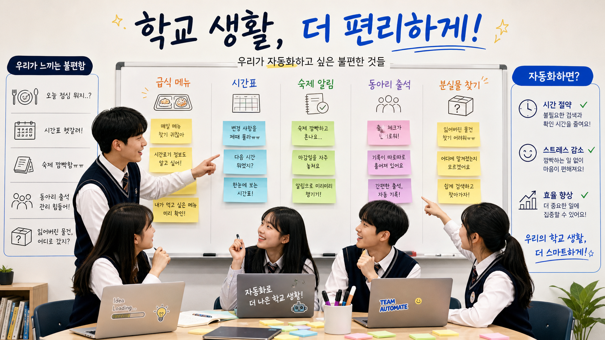

<SectionLabel section="INTRODUCTION" />

오늘 강연을 시작하며

어려운 말은 줄이고, 
쉬운 예시로 이야기합니다

진로

아직 진로를 몰라도 괜찮습니다

관점

코딩보다 중요한 건 문제를 보는 눈입니다

시작

반복되는 일을 줄이는 것이 프로그래밍의 시작입니다

오늘 기억할 한 문장

반복되는 일은 컴퓨터에게 맡길 수 있습니다

<PageFooter light />

<!--
**[오늘 강연을 시작하며 · 약 1분]**

오늘은 어려운 말은 줄이고 — 쉬운 예시로 이야기하겠습니다.
모르는 단어 나오면 바로 풀어서 말할게요.

그리고 시작하기 전에 세 가지 말씀드리고 싶은 게 있습니다.
- 첫째, 진로 — 아직 정해지지 않아도 괜찮아요. 여러분은 지금 1학년이니까요.
- 둘째, 코딩 실력보다 — **문제를 보는 눈** 이 훨씬 중요해요.
- 셋째, **반복되는 일을 줄이는 것** — 거기에서 프로그래밍이 시작됩니다.

그러니까 오늘 한 문장만 가져가면 됩니다.
**반복되는 일은, 컴퓨터에게 맡길 수 있다.** 이거예요.
-->

---
layout: default
---

<SectionLabel section="INTRODUCTION" />

손들어 봅시다

여러분은 
무엇을 가장 귀찮아하나요?

📝 수행평가 마감

🧹 청소·정리 당번

⏰ 학원·야자·방과후

📚 매일 복습·노트 정리

💬 단톡방·학교 공지 챙기기

예시 — 어떤 게 가장 마음에 와닿나요?

<PageFooter />

<!--
**[손들어 봅시다 · 약 2분 — 인터랙션]**

자, 그러면 손드는 시간이에요. 부담 없이 들어주세요.

라고 말하려고 했지만, 손드는 것도 귀찮을 거지요?

여러분들이 귀찮을 만한 예시 좀 적어 봤어요 — 수행평가 마감,
청소·정리 당번, 학원·야자·방과후, 매일 복습·노트 정리,
단톡방·학교 공지 챙기기.

맞나요?

**오늘 강연 끝날 때 이 중에 하나를 골라서
— 어떻게 컴퓨터한테 맡길 수 있는지 같이 만들어 볼 거예요.**

→ 다음 슬라이드 전환: "그러면 프로그래머는 도대체 뭘 하는 사람일까요?"
-->
