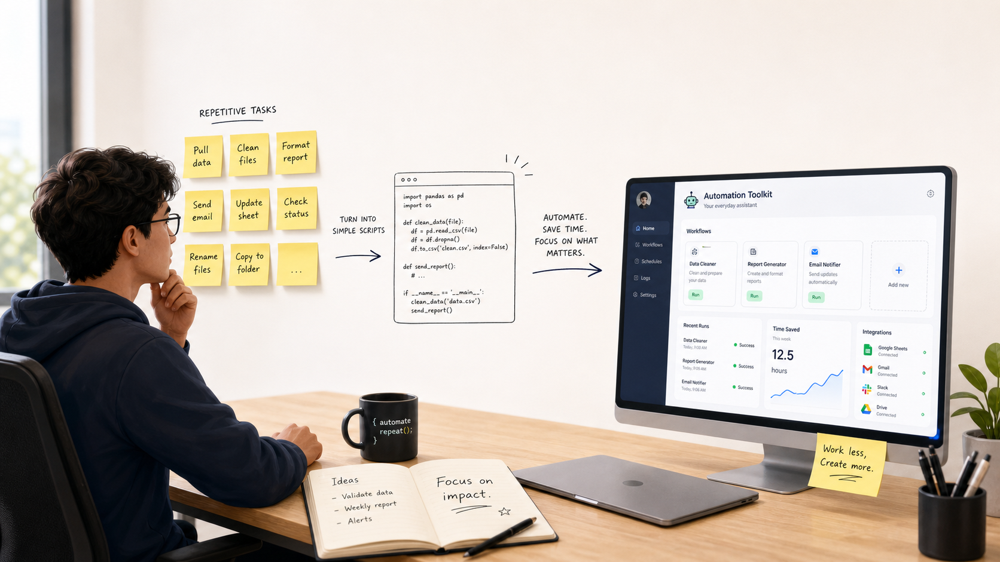
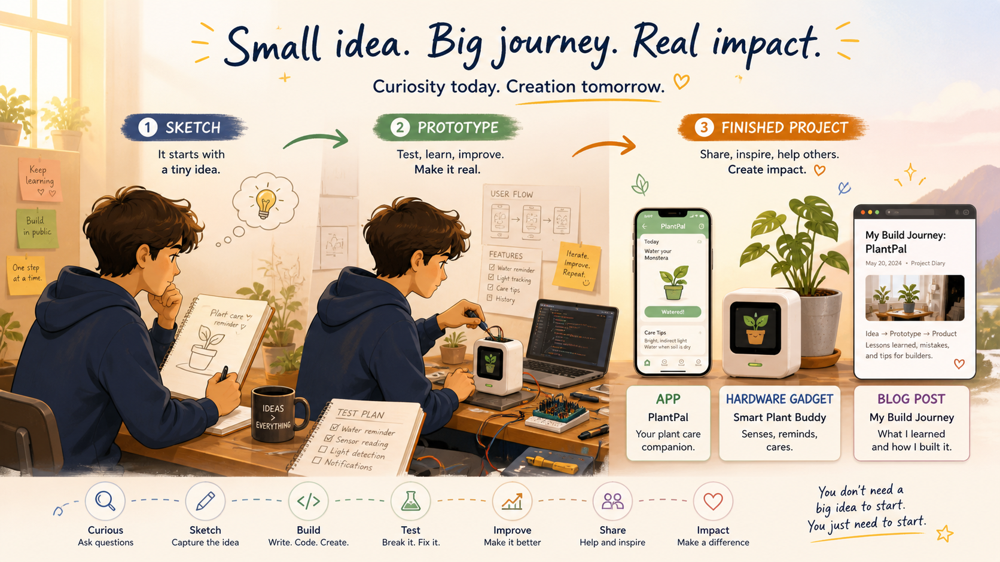

<SectionLabel section="MINDSET" />

프로그래머는 무엇을 하는 사람일까요?

사람이 반복해서 하는 일을 
조금 더 편하게 만드는 사람

거창한 앱을 만드는 일보다, <strong>작은 자동화</strong>에서 시작하는 경우가 더 많습니다

<PageFooter light />

<!--
**[프로그래머는 무엇을 하는 사람? · 약 1분]**

자, 그러면 프로그래머는 도대체 뭘 하는 사람일까요?

영화에서 보면 검은 화면에 초록색 글자가 빠르게 지나가는 사람들 있잖아요.
혹은 검은 화면 앞에 멍하게 앉아서 키보드 두드리는 사람들 있잖아요. 그런 모습이 떠오르나요?

프로그래머는 — **사람이 반복해서 하는 일을 조금 더 편하게 만드는 사람** 입니다.

거창한 앱을 만들기보다 — 사실은 **작은 자동화** 에서 시작하는 경우가 훨씬 많아요.
오늘 보여드릴 제 사례도 다 그랬습니다.
-->

---
layout: default
---

<SectionLabel section="MY STORY" />

저는 이렇게 시작했습니다

저는 어려서부터 컴퓨터를 접했고

어려운 문제를 만나면 직접 만들어 보고, 고쳐 왔습니다

그러다 보니 — <strong class="text-white">프로그래머가 되어 있더라고요</strong>

<PageFooter />

<!--
**[저는 이렇게 시작했습니다 · 약 1분 30초]**

저는 어려서부터 컴퓨터를 접했어요.
어려운 문제를 만나면 직접 만들어 보고, 안 되면 고쳐 보고 —
그러다 보니 어느새 **프로그래머가 되어 있더라고요**.

그러니까 여러분도 — 지금 **'나는 진짜 개발자 체질일까?'** 고민하고 있다면,
답은 단순해요. 작은 문제 하나만 직접 해결해 보세요.
그게 **답을 가장 빨리 찾는 방법** 입니다.

→ 다음 슬라이드 전환: "제가 좋아하는 개발은 — 이런 다섯 단계로 굴러갑니다."
-->
