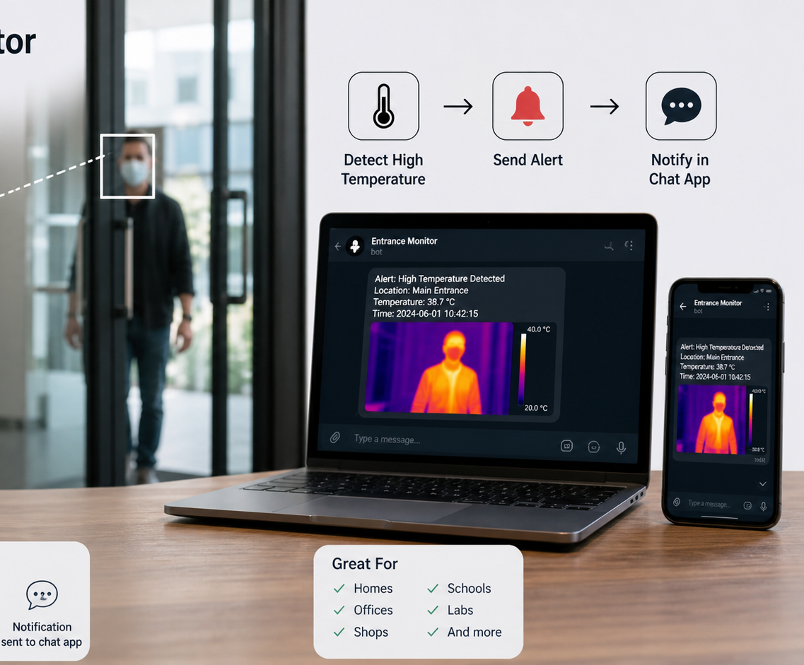
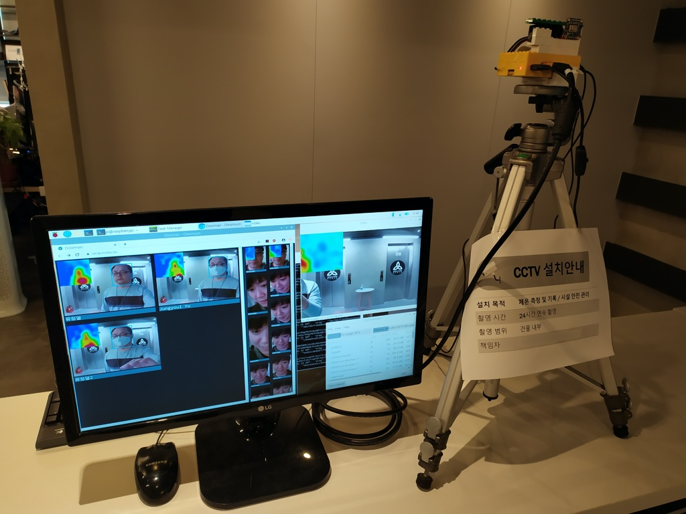

<SectionLabel class="mb-8">CASE STUDY · 02</SectionLabel>

체온 알람 서비스

사람이 계속 보고 있던 화면을 <strong class="text-white">컴퓨터가 보게</strong> 만들기

<PageFooter />

<!--
**[사례 2 · 커버 · 약 30초]**

두 번째 — **체온 알람 서비스** 입니다.

이건 코로나 시기에 만든 거예요.
**열화상카메라로 체온을 재고, 일반 카메라로 안면인식을 해서,
정해둔 온도를 넘으면 알림을 보내는** 시스템이에요.

한 줄로 정리하면 — **사람이 계속 보고 있던 화면을, 컴퓨터가 보게 만든 이야기**.
-->

---
layout: default
---

<SectionLabel section="CASE STUDY 02" />

문제는 여기에도 있었습니다

누군가가 계속 옆에 서서 화면을 보고 있어야 했다

사람이 계속 지켜봐야 하는 일은 — 좋은 자동화 후보입니다

BEYOND HARDWARE

열화상 카메라(체온이 색으로 보이는 카메라)만 있다고 끝이 아니다

RESPONSE TIME

이상이 생긴 상황을 빨리 알려줘야 한다

RECORDS

기록도 남아야 나중에 확인할 수 있다

<PageFooter light />

<!--
**[문제는 여기에도 있었습니다 · 약 1분]**

문제는 이거였어요. 어디 건물 들어가면 입구에 열화상 카메라 있던 거 기억나세요?
체온이 색깔로 보이는 카메라요.

그 카메라 옆에 — **사람이 한 명 계속 서서 화면을 봐야 했어요**.
누가 열이 있나 없나 보려고요.

사람이 계속 지켜봐야 하는 일 — 이게 좋은 자동화 후보예요.
카메라만 있다고 끝나는 게 아니거든요.
이상이 생기면 빨리 알려줘야 하고, 기록도 남아야 합니다.
-->

---
layout: default
---

<SectionLabel section="CASE STUDY 02" />

아이디어는 이렇게 흘러갑니다

01

DETECT

열화상카메라로 체온을 본다

→

02

PROCESS

안면인식 + 온도 비교

→

03

STORE

기록을 서버에 남긴다

→

04

NOTIFY

온도 초과 시 메신저 알림

왜 라즈베리파이?

<strong class="text-white">열화상 카메라 + 일반 카메라</strong> 둘 다 연결하려고요

열화상 카메라

<strong class="text-white">FLIR Lepton 3.5</strong> — 사람 체온을 또렷이 볼 수 있는 열화상 센서

핵심은 기술의 이름이 아니라 — 흐름입니다

<PageFooter />

<!--
**[아이디어는 이렇게 흘러갑니다 · 약 1분]**

그래서 흐름을 이렇게 만들었어요.

- **01 DETECT** — 열화상카메라로 체온을, 일반 카메라로 얼굴을 본다.
- **02 PROCESS** — 작은 컴퓨터가 안면인식을 하고, 정해둔 온도와 비교한다.
- **03 STORE** — 누가 언제 어떤 체온이었는지 서버에 기록한다.
- **04 NOTIFY** — 온도를 넘으면 메신저로 바로 알려준다.

라즈베리파이(작은 컴퓨터)를 쓴 이유는 — **열화상 카메라랑 일반 카메라, 둘 다 연결**해야 했거든요.

열화상 카메라는 — **FLIR Lepton 3.5**. 사람 체온을 또렷하게 볼 수 있는 센서예요.

핵심은 — **기술의 이름** 이 아니에요. **흐름** 입니다.
무엇을 감지해서, 어디에 저장하고, 누구한테 어떻게 알릴지 —
이 흐름만 머릿속에 그려지면, 어떤 도구로 만들지는 그 다음 문제예요.
-->

---
layout: default
---

<SectionLabel section="CASE STUDY 02" />

이 프로젝트에서 배운 것

자동화는 "사람이 계속 지켜보는 일"을 줄여 줍니다

→
센서 + 코드 + 알림이 연결되면 — 유용해진다

→
문제 해결은 한 가지 기술이 아니라 — 여러 조각의 연결이다

→
사람을 편하게 하는 것이 — 좋은 개발이다

<PageFooter light />

<!--
**[배운 것 · 약 1분]**

여기서 배운 거 — 자동화는 **'사람이 계속 지켜보는 일'을 줄여 준다**.

- 센서 + 코드 + 알림이 연결되면 갑자기 유용해진다.
- 문제 해결은 한 가지 기술이 아니라 — **여러 조각의 연결** 이다.
- 사람을 편하게 하는 게 — 좋은 개발이다.

→ 다음 슬라이드 전환: "마지막 세 번째 사례. 이건 제가 지금도 매일 쓰고 있는 도구예요."
-->
