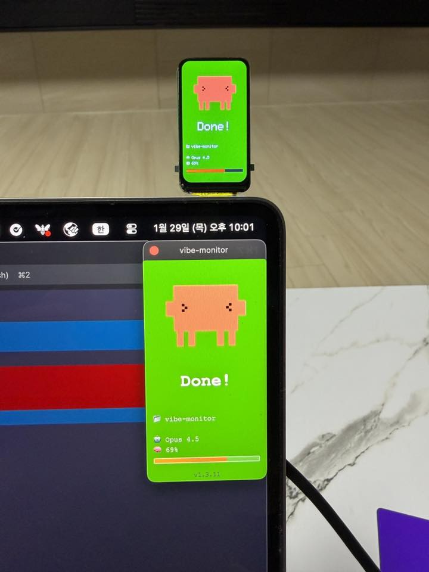

<SectionLabel class="mb-8">CASE STUDY · 03</SectionLabel>

VibeMon

AI가 지금 뭘 하고 있는지 <strong class="text-white">한눈에 보이게</strong> 만들기

<PageFooter />

<!--
**[사례 3 · 커버 · 약 30초]**

세 번째 — **VibeMon** 입니다. Vibe + Monitor — 분위기를 보여준다는 뜻이에요.

시작은 정말 단순했어요 — **"이 작은 LCD 화면에 뭘 띄울까?"**.
그 한 마디에서 시작한 프로젝트입니다.

한 줄로 — **AI가 코드 짜는 동안 다른 일 할 수 있게, 상태를 한눈에 보이게 만든 이야기**.
-->

---
layout: default
---

<SectionLabel section="CASE STUDY 03" />

이번엔 이런 불편함이 있었습니다

검은 글자 화면(터미널)을 계속 보고 있지 않아도 상태를 알 수는 없을까?

작은 LCD 화면에서 시작한 아이디어였습니다

VISIBILITY

AI가 생각 중인지, 작업 중인지 보고 싶다

TIMING

언제 끝나는지 바로 알고 싶다

DELIGHT

그냥 텍스트보다 — 재미있게 보여 주고 싶다

<PageFooter light />

<!--
**[이번엔 이런 불편함 · 약 1분]**

요즘 AI 코딩 도구들 많이 쓰잖아요.
ChatGPT, Claude Code, Copilot — 들어보신 분들 있을 거예요.

근데 이런 도구한테 일을 시켜놓으면 — 검은 화면에 글자가 천천히 한 줄씩 올라와요.
그걸 멍하니 보고 있어야 해요.

그래서 생각했어요 — '터미널 안 봐도 상태를 알 수는 없을까?'

보고 싶었던 건 세 가지였어요.
- **VISIBILITY** — 지금 생각 중인지 작업 중인지.
- **TIMING** — 언제 끝나는지.
- **DELIGHT** — 그냥 텍스트 말고, 좀 재밌게.
-->

---
layout: default
---

<SectionLabel section="CASE STUDY 03" />

작은 시작이 점점 커졌습니다

1

작은 화면으로 먼저 만들어 봤다

2

웹에서 미리 보게 했다

3

내 컴퓨터에서 쓰는 앱으로 키웠다

4

웹사이트로 누구나 보게 했다

16일

총 작업 기간

600+

커밋(작업 기록)

vibemon.io

지금도 운영 중

PRINCIPLE

작게 만들어 본 뒤에, 정말 쓸 만하면 더 키워 갑니다

<PageFooter />

<!--
**[작은 시작이 점점 커졌습니다 · 약 1분 30초]**

처음엔 정말 작게 시작했어요.

- **1단계** — 손바닥만 한 작은 LCD 화면 하나로 먼저 만들어 봤어요. 진짜 장난감 같았어요.
- **2단계** — 그게 되니까, 웹에서 미리 보게 만들었어요.
- **3단계** — 또 그게 되니까, 내 컴퓨터에서 항상 띄워두는 앱으로 키웠어요.
- **4단계** — 결국엔 누구나 쓸 수 있는 웹사이트가 됐어요. **vibemon.io** — 지금도 돌아갑니다.

그리고 — 이거 다 합쳐서 **16일 만에** 만들었어요. 600개 넘는 커밋(작업 기록).
"작게 시작해서 빨리 만든다"가 진짜 뭔지 — 이 숫자가 보여줍니다.

이 과정에서 배운 한 가지 — **작게 만들어 보고, 정말 쓸 만하면 더 키워간다**.

처음부터 큰 그림을 다 그릴 필요 없어요.
사실 다 그려놓고 시작하면 — 거의 다 안 끝납니다.
-->

---
layout: default
---

<SectionLabel section="CASE STUDY 03" />

그리고 — 한 가지 더 신경 썼어요. 어떻게 보여줄지.

VibeMon은 <strong class="text-white">표정</strong>으로 말합니다 — AI가 지금 뭘 하는지, 한 번 보면 바로 알 수 있게

■ ■

IDLE

대기 중 (깜빡깜빡)

💭

THINKING

생각 중 (말풍선)

🕶️

WORKING

작업 중 (매트릭스 모드)

&gt; &lt;

DONE

끝 (뿌듯한 눈)

─ ─ Z

SLEEP

잠 (5분 비활성)

왜 표정으로?

텍스트보다 표정이 — <strong class="text-white">한눈에 보입니다</strong>. 멀리서 봐도 상태가 잡혀요

재미있는 건

VibeMon은 — <strong class="text-white">AI랑 같이 만든 도구</strong>예요. 그 도구가 지금 — 그 AI를 보고 있는 거고요

<PageFooter />

<!--
**[표정으로 말합니다 · 약 30초]**

이렇게 키워가면서 — 한 가지 더 신경 쓴 게 있어요. **어떻게 보여줄지.**

VibeMon은 — **표정** 으로 말해요.

- ■ ■ 깜빡깜빡 — 대기 중
- 💭 말풍선 — 생각 중
- 🕶️ 매트릭스 선글라스 — 작업 중
- > < 뿌듯한 눈 — 끝
- ─ ─ Z — 5분 동안 안 쓰면 잠

텍스트로 "thinking", "working" 이렇게 적어 두면 — 한 번에 안 들어와요.
근데 표정으로 보여주면 — 멀리서 슬쩍 봐도 상태가 잡혀요.

그리고 재미있는 게 하나 있어요. VibeMon은 — **AI랑 같이 만든 도구**입니다.
Claude Code랑 같이 코드 짜면서 만들었거든요.
그 도구가 지금 — 그 AI를 보고 있는 거예요. 좀 메타하죠.
-->

---
layout: default
---

<SectionLabel section="CASE STUDY 03" />

이 프로젝트에서 배운 것

작은 장난감처럼 시작한 것도 진짜 프로젝트가 될 수 있습니다

→
재미가 있어야 — 오래 만든다

→
직접 쓰는 도구는 — 더 빨리 좋아진다

→
기록하면 — 다음 프로젝트의 재료가 된다

<PageFooter light />

<!--
**[배운 것 · 약 30초]**

여기서 배운 거 — 작은 장난감처럼 시작한 것도 진짜 프로젝트가 될 수 있다.

- **재미가 있어야** 오래 만든다.
- 직접 쓰는 도구는 **더 빨리 좋아진다**.
- 기록하면 — 다음 프로젝트의 재료가 된다.

→ 다음 슬라이드 전환: "사례 세 개 봤어요. 뭔가 비슷한 패턴이 보이지 않았어요?"
-->
