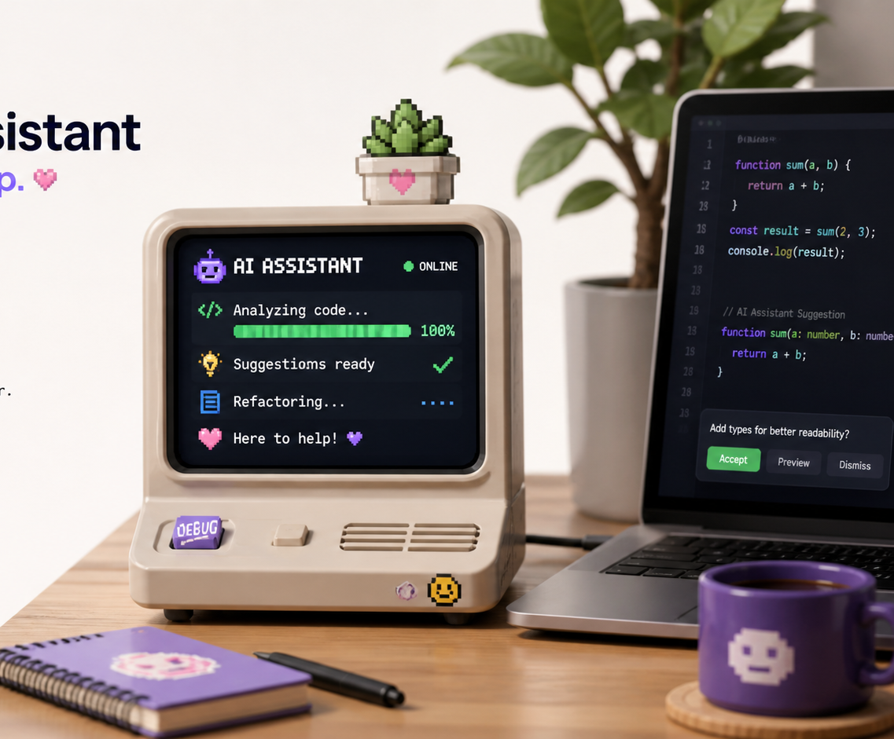

<SectionLabel class="mb-8">CASE STUDY · 03</SectionLabel>

VibeMon

AI가 지금 뭘 하고 있는지 <strong class="text-white">한눈에 보이게</strong> 만들기.

<PageFooter />

---
layout: default
---

<SectionLabel section="CASE STUDY 03" />

이번엔 이런 불편함이 있었습니다

터미널을 계속 보고 있지 않아도 상태를 알 수 없을까?

작은 LCD 화면에서 시작한 아이디어였습니다.

VISIBILITY

AI가 생각 중인지, 작업 중인지 보고 싶다.

TIMING

언제 끝나는지 바로 알고 싶다.

DELIGHT

그냥 텍스트보다 — 재미있게 보여 주고 싶다.

<PageFooter light />

---
layout: default
---

<SectionLabel section="CASE STUDY 03" />

작은 시작이 점점 커졌습니다

1

작은 화면 프로토타입

2

웹 시뮬레이터

3

데스크톱 앱

4

웹 대시보드

PRINCIPLE

작게 만들어 본 뒤에, 정말 쓸 만하면 확장합니다.

처음부터 큰 그림을 다 그릴 필요는 없습니다.

<PageFooter />

---
layout: default
---

<SectionLabel section="CASE STUDY 03" />

이 프로젝트에서 배운 것

작은 장난감처럼 시작한 것도 진짜 프로젝트가 될 수 있습니다.

→
재미가 있어야 — 오래 만든다.

→
직접 쓰는 도구는 — 더 빨리 좋아진다.

→
기록하면 — 다음 프로젝트의 재료가 된다.

<PageFooter light />

