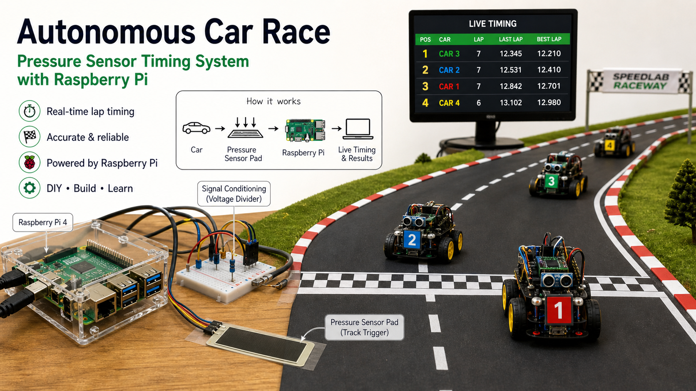
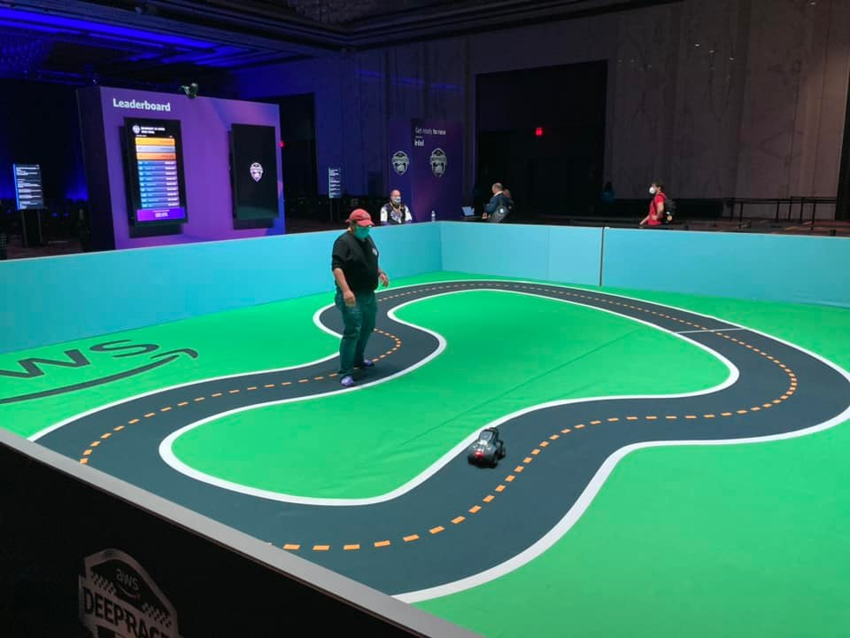

<SectionLabel class="mb-8">CASE STUDY · 01</SectionLabel>

DeepRacer Timer

사람이 재던 시간을 <strong class="text-white">센서가 재게</strong> 만들기

<PageFooter />

<!--
**[사례 1 · 커버 · 약 30초]**

첫 번째 사례 — **DeepRacer Timer** 입니다.

DeepRacer는 아까 말씀드린 AWS의 자율주행 자동차예요.
1/18 크기 작은 자동차인데, 강화학습으로 훈련을 시키면 트랙을 스스로 달립니다.
그리고 누가 한 바퀴를 가장 빨리 도는지 경쟁하는 대회를 열었습니다.

한 줄로 정리하면 — **사람이 재던 시간을, 센서가 재게 만든 이야기** 입니다.
-->

---
layout: default
---

<SectionLabel section="CASE STUDY 01" />

문제는 단순했습니다

차가 지나갈 때마다 한 바퀴 시간(랩타임)을 정확하게 재고 싶다

사람이 수동으로 재면 — 늦거나 놓칠 수 있습니다

측정의 정확성

경주에서는 시간 측정이 가장 중요하다

사람의 한계

사람 손으로 누르면 반드시 오차가 생긴다

센서의 강점

차가 지나간 순간을 센서가 감지하면 정확하다

<PageFooter light />

<!--
**[문제는 단순했습니다 · 약 30초]**

문제는 단순했어요. 차가 트랙을 한 바퀴 도는 시간(랩타임) — 이걸 정확하게 재고 싶었습니다.

그런데 사람이 스톱워치로 누르면? 무조건 늦어요.
사람 반응 속도가 차보다 느리니까요.

그래서 세 가지를 생각했어요.
- **측정의 정확성**
- **사람의 한계**
- **센서의 강점** — 차가 지나간 그 순간을 센서가 잡으면 정확합니다.
-->

---
layout: default
---

<SectionLabel section="CASE STUDY 01" />

처음부터 잘 되지는 않았습니다

앞바퀴가 밟아도 기록이 안 되는 경우가 있었다

01

관찰

차가 지나갔는데 기록이 안 남았다

02

질문

"왜 놓쳤지?"를 더 구체적으로 봤다

03

수정

센서 위치와 연결 방식을 바꿨다

<PageFooter />

<!--
**[처음부터 잘 되지는 않았습니다 · 약 1분]**

그런데 — **처음부터 잘 되지는 않았어요**.

앞바퀴는 분명히 지나갔는데 기록이 안 되는 경우가 있었어요.
'왜 안 되지?' 하고 그냥 두면 거기서 끝이에요.

그래서 세 가지를 다시 봤습니다.
- **01 관찰** — 차가 지나갔는데 기록이 안 남는 장면을 다시 봤어요.
- **02 질문** — '왜 놓쳤지?'를 더 구체적으로 봤습니다.
- **03 수정** — 센서 위치와 연결 방식을 바꿔 다시 테스트했습니다.

'왜?'를 한 번 더 묻는 거 — 이게 디버깅의 시작입니다.
-->

---
layout: default
---

<SectionLabel section="CASE STUDY 01" />

고친 방법

넓게 보기

차가 지나가는 범위를 <strong>충분히 넓게</strong> 잡았다

흔들림 줄이기

신호가 흔들리지 않게 <strong>가까이, 단순하게</strong> 연결했다

현장에서 확인

책상이 아니라 <strong>실제 트랙에서</strong> 다시 테스트했다

DEBUG LOOP

왜? → 다시 본다 → 다시 만든다

개발은 한 번에 완성하는 일이 아니라 실패한 이유를 보고 다시 만드는 일입니다

<PageFooter light />

<!--
**[고친 방법 · 약 1분]**

결국 이렇게 고쳤어요.

- **넓게 보기** — 차가 지나가는 범위를 충분히 넓게 잡았습니다.
- **흔들림 줄이기** — 신호가 흔들리지 않게 가까이, 단순하게 연결했습니다.
- **현장에서 확인** — 마지막엔 실제 트랙에서 다시 테스트했습니다.

결국 **개발은 한 번에 완성하는 일이 아니라, 실패한 이유를 보고 다시 만드는 일** 입니다.
한 번에 되면 그건 운이에요.
-->

---
layout: default
---

<SectionLabel section="CASE STUDY 01" />

이 프로젝트에서 배운 것

자동화는 "사람 대신 정확하게 하게 만드는 것"

→
센서와 작은 컴퓨터(라즈베리파이)로 해결할 수 있다

→
문제를 직접 겪어야 더 좋은 도구가 나온다

→
테스트는 실제 상황에서 해야 한다

실제 사용처

<strong class="text-[#F96167]">AWS re:Invent DeepRacer League Final 2022 · 2023 · 2024</strong> — 글로벌 결승에서 공식 타이머로 사용

<PageFooter />

<!--
**[배운 것 · 약 1분]**

이 프로젝트에서 배운 것 — 자동화는 **'사람 대신 정확하게 하게 만드는 것'** 입니다.

- 센서랑 작은 컴퓨터(라즈베리파이라고 부르는 손바닥만한 컴퓨터예요)로 해결할 수 있다.
- 문제를 직접 겪어야 좋은 도구가 나온다.
- 테스트는 책상에서 말고 — 실제 상황에서 해야 한다.

그리고 — 이게 진짜 큰 무대에서 썼어요.
**AWS re:Invent DeepRacer Final 2022, 2023, 2024**.

re:Invent는 AWS가 매년 라스베이거스에서 여는 글로벌 컨퍼런스예요.
거기 결승에서 — 제 타이머가 공식으로 쓰였습니다.

근데 — 시작은 압력 센서 하나였어요. 그 한 조각에서 시작한 거예요.
여러분도 — 시작은 늘 한 조각입니다.

→ 다음 슬라이드 전환: "두 번째 사례입니다."
-->
