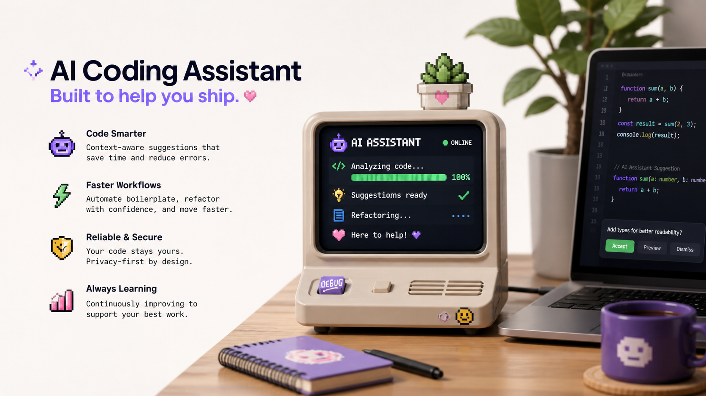

<SectionLabel section="YOUR TURN" />

AI는 이렇게 쓰면 좋습니다

DON'T

코드를 대신 짜 달라고만 하지 않기

DO

먼저 내가 뭘 만들고 싶은지 한 줄로 적기

DON'T

AI가 준 답을 그대로 믿어 버리기

DO

직접 실행해 보고, 틀린 부분을 고치면서 배우기

<PageFooter />

<!--
**[AI는 이렇게 쓰면 좋습니다 · 약 1분 30초]**

요즘 여러분 세대한테는 진짜 중요한 얘기 하나만 드릴게요. **AI 사용법**.

솔직히 ChatGPT한테 '이거 코드 짜줘' 한 마디로 거의 다 됩니다. 안 해본 분 거의 없을 거예요.

근데 그것만 하면 — 늘지 않아요. 두 가지만 약속해 주세요.

- **DON'T** 코드 대신 짜 달라고만 하지 않기 → **DO** 먼저 내가 뭘 만들고 싶은지 한 줄로 적기
- **DON'T** AI가 준 답을 그대로 믿어버리기 → **DO** 직접 실행해 보고, 틀린 부분 고치면서 배우기

AI는 — 완성된 답을 주는 도구가 아니라 **같이 만드는 동료** 라고 생각하세요.
그래야 남는 게 있어요.
-->

---
layout: default
---

<SectionLabel section="YOUR TURN" />

고1 때 하면 좋은 다섯 가지

01

작은 것 하나라도 만들어 보기

02

GitHub(코드를 올리는 사이트)나 블로그에 기록 남기기

03

친구와 같이 써 볼 프로젝트 해 보기

04

실패한 이유를 적어 보기

05

반복되는 일을 그냥 넘기지 않기

<PageFooter light />

<!--
**[고1 때 하면 좋은 다섯 가지 · 약 1분 30초]**

고1 때 진짜 하면 좋은 다섯 가지.

- 01 작은 것 하나라도 직접 만들어 보기.
- 02 GitHub — 코드를 올리는 사이트인데 — 거기나 블로그에 기록 남기기.
- 03 친구랑 같이 써볼 프로젝트 해보기.
- 04 **실패한 이유를 적어 보기**. 이게 진짜 중요해요. 잘된 것보다 안 된 것 적은 게 나중에 더 큰 자산입니다.
- 05 반복되는 일을 그냥 넘기지 않기.

다섯 개 다 못 하셔도 됩니다. 한 개라도 시작하시면 충분해요.
-->

---
layout: default
---

<SectionLabel section="YOUR TURN" />

그리고 — 꼭 남겨 보세요

만든 것을 기록하면 경험이 실력이 됩니다

BLOG

블로그 글 한 편

README

짧은 프로젝트 설명서 한 장

RETRO

실패한 이유 메모

NEXT

다음에 고칠 점

<PageFooter />

<!--
**[꼭 남겨 보세요 · 약 1분]**

그리고 마지막으로 — 만든 거 꼭 **기록** 하세요.

만든 것을 기록하면 — **경험이 실력으로 바뀝니다**.

형식은 자유예요.
- 블로그 글 한 편
- 짧은 README 한 장
- 실패한 이유 메모
- 다음에 고칠 점

— 뭐든 좋습니다.

기억해 두세요. 면접 갈 때 면접관이 보는 건 — '얼마나 똑똑하냐' 가 아니에요.
**'문제를 보고, 시도하고, 배운 흔적이 있느냐'** 입니다.
기록이 그걸 증명해 줍니다.
-->
