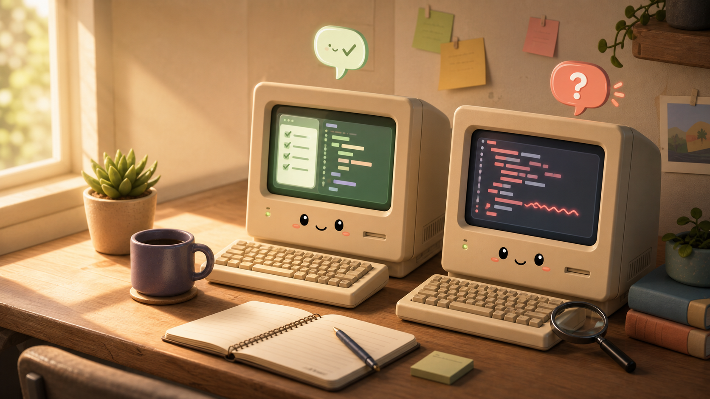
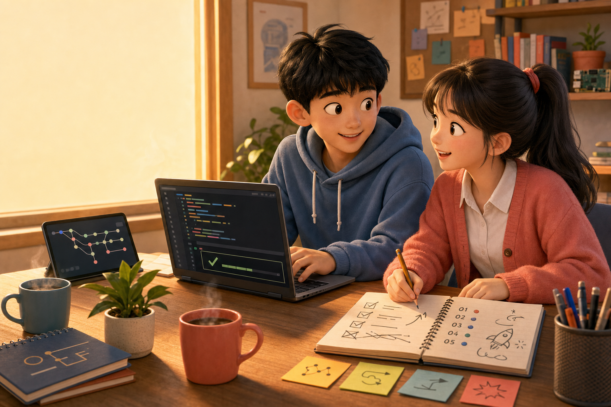
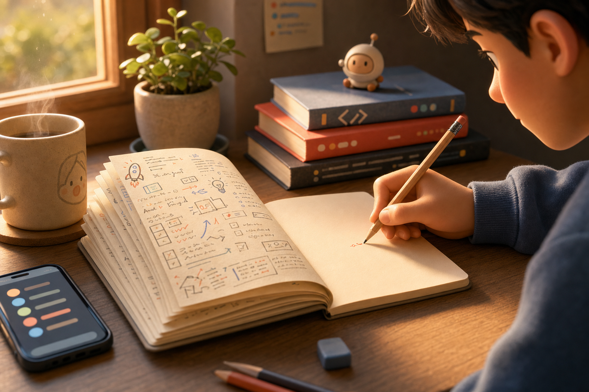

<SectionLabel section="YOUR TURN" />

AI는 이렇게 쓰면 좋습니다

AI가 옆에서 도와주는 시대 — 잘 쓰는 사람은 결국 이 두 가지를 잘 합니다

ABILITY 01

맥락(context)을 챙기며 일 시키기

내가 뭘 만들고 싶은지, 지금 어디까지 왔는지 — 끝까지 같이 챙기면서 AI에게 한 단계씩 일을 맡기는 능력

ABILITY 02

"자신 있게 틀릴 때" 빨리 알아채기

AI는 모를 때도 당당하게 답합니다 — 직접 돌려보고, 어색한 부분을 의심하는 눈

<PageFooter />

<!--
**[AI는 이렇게 쓰면 좋습니다 · 약 1분 30초]**

자, 예시 다섯 가지 보셨죠. 그러면 이걸 **어떻게** 만들까요?
옛날엔 한땀 한땀 코드를 짜야 했어요. 그런데 요즘은 — **AI 가 옆에서 도와줍니다**.
솔직히 'ChatGPT한테 이거 짜줘' 한 마디로 절반은 됩니다.

근데 — 그것만 하면 늘지 않아요. 제가 생각하는 **AI를 잘 쓰는 사람의 차이**는 결국 이 두 가지입니다.

- **하나, 맥락(context)을 챙기며 일을 시키는 능력.** AI한테 한 번에 다 떠넘기지 말고 — 내가 뭘 만들고 싶은지, 지금 어디까지 왔는지, 다음에 뭘 할 건지를 같이 챙겨야 합니다. 그래야 AI도 제대로 도와줘요. 통째로 던지면 — 그럴듯한데 엉뚱한 게 나옵니다.

- **둘, AI가 "자신 있게 틀릴 때" 그걸 빨리 알아채는 능력.** 이게 진짜 중요해요. AI는 모를 때도 당당하게 답합니다. 말투에 자신감이 있다고 정답인 게 아니에요. 그래서 — 직접 돌려보고, 결과가 어색하면 의심하는 눈이 필요합니다.

이 두 가지가 되면 — AI는 완성된 답을 주는 도구가 아니라 **같이 만드는 동료**가 됩니다. 그래야 남는 게 있어요.

→ 다음 슬라이드 전환: "그리고 — 고1 때 하면 좋은 다섯 가지."
-->

---
layout: default
---

<SectionLabel section="YOUR TURN" />

고1 때 하면 좋은 다섯 가지

01

작은 것 하나라도 만들어 보기

02

GitHub(코드를 올리는 사이트)나 블로그에 기록 남기기

03

친구와 같이 써 볼 프로젝트 해 보기

04

실패한 이유를 적어 보기

05

반복되는 일을 그냥 넘기지 않기

<PageFooter light />

<!--
**[고1 때 하면 좋은 다섯 가지 · 약 1분 30초]**

그래서 — 고1 때 하면 좋은 다섯 가지.

- 01 작은 것 하나라도 직접 만들어 보기.
- 02 GitHub — 코드를 올리는 사이트인데 — 거기나 블로그에 기록 남기기.
- 03 친구랑 같이 써볼 프로젝트 해보기.
- 04 **실패한 이유를 적어 보기**. 이게 진짜 중요해요. 잘된 것보다 안 된 것 적은 게 나중에 더 큰 자산입니다.
- 05 반복되는 일을 그냥 넘기지 않기.

다섯 개 다 못 하셔도 됩니다. 한 개라도 시작하시면 충분해요.

→ 다음 슬라이드 전환: "그리고 다시 강조하지만 — 만든 거 꼭 기록하세요."
-->

---
layout: default
---

<SectionLabel section="YOUR TURN" />

다시 강조하지만 — 꼭 남겨 보세요

기록 안 하면 — 미래의 내가 또 처음부터 합니다. 그것도 결국 귀찮은 일이에요

만든 것을 기록하면 경험이 실력이 됩니다

기록은 — 미래의 나를 위한 자동화입니다. 같은 문제를 또 처음부터 안 풀게.

BLOG

블로그 글 한 편

README

짧은 프로젝트 설명서 한 장

RETRO

실패한 이유 메모

NEXT

다음에 고칠 점

<PageFooter />

<!--
**[꼭 남겨 보세요 · 약 1분 30초]**

그리고 — 만든 거 꼭 **기록** 하세요.

이유 한 가지만 말씀드릴게요. 기록 안 하면 — **다음에 똑같은 문제를 만났을 때, 미래의 내가 또 처음부터 풀어야 합니다**. 같은 시간을 한 번 더 써요. 그것도 결국 — 귀찮은 일이잖아요. 그래서 — **기록은 미래의 나를 위한 자동화** 입니다.

만든 것을 기록하면 — **경험이 실력으로 바뀝니다**.

형식은 자유예요.
- 블로그 글 한 편
- 짧은 README 한 장
- 실패한 이유 메모
- 다음에 고칠 점

— 뭐든 좋습니다.

면접 갈 때도 — 면접관이 보는 건 '얼마나 똑똑하냐' 가 아니라 **'문제를 보고, 시도하고, 배운 흔적이 있느냐'** 예요. 기록이 그걸 증명해 줍니다.

→ 다음 슬라이드 전환: "오늘 하나만 가져가시면 됩니다."
-->
