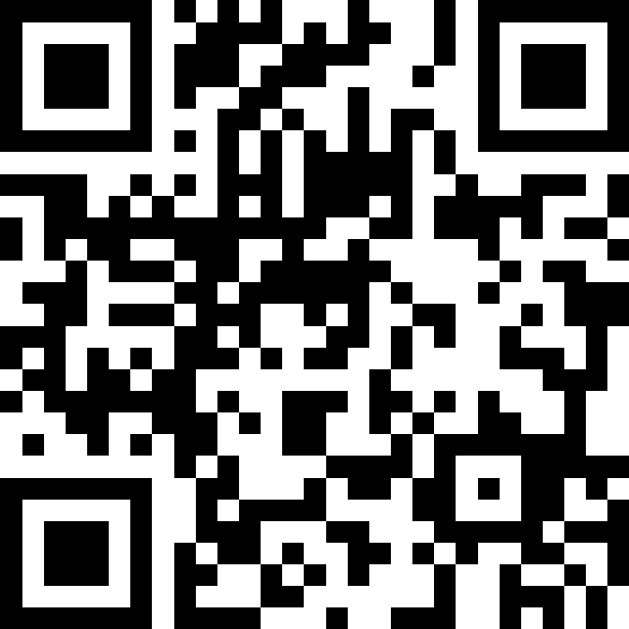

<SectionLabel section="HANDS-ON" />

핸드폰을 꺼내 — 슬리도에서 골라봅시다

01

SCAN

QR 찍기

다음 슬라이드 QR로 접속

02

VOTE

한 가지 고르기

다섯 가지 중 가장 불편한 것

03

SUBMIT

제출하기

한 번 클릭이면 OK

FORMAT

"다섯 가지 중 가장 불편한 것 — 한 표"

DEADLINE

수행평가 마감

DUTY

청소 당번

SCHEDULE

학원·방과후

STUDY

매일 복습

NOTICE

단톡방·공지

시간 · 약 3분

<PageFooter />

<!--
**[슬리도에서 투표하기 · 약 3분 — 인터랙션]**

핸드폰 꺼내 주세요. 3분만 시간 드릴 거예요.

다음 슬라이드에 QR 코드 띄울 테니까 — 슬리도(Slido)로 들어와서 —
**아까 본 다섯 가지 중에 가장 불편한 것 한 가지** 만 골라 주세요.

다섯 가지 다시 한 번 짚어 드릴게요.
**DEADLINE** 수행평가 마감, **DUTY** 청소 당번,
**SCHEDULE** 학원·방과후, **STUDY** 매일 복습, **NOTICE** 단톡방·공지.

한 번 클릭이면 충분합니다. 익명이고, 정답 없어요.
**가장 많은 표를 받은 것** 을 — 다음에 같이 만들어 볼 거예요.

→ 다음 슬라이드 전환: "QR 코드 띄울게요."
-->

---
layout: default
---

<SectionLabel section="SLIDO" />

한 표면 충분합니다

QR — 슬리도 (Slido)

FORMAT

"다섯 가지 중 가장 불편한 것 — 한 표"

RESULT

가장 많은 표를 받은 한 가지  → <strong>지금 같이 만들어 봅니다</strong>

한 번 클릭이면 OK

5개 중 하나

익명·정답 없음

<PageFooter light />

<!--
**[QR · 한 표면 충분합니다 — QR 띄우는 동안]**

QR 찍고 슬리도(Slido)로 들어오세요.

시간 3분 드립니다. 5개 중에 가장 불편한 거 하나만 골라서 클릭해 주세요.

(3분 대기. 학생들이 투표하는 동안 슬리도 결과 화면을 띄워두기 — 실시간으로 막대가 올라가는 게 학생 핸드폰에도 보임)

"오, 막대가 올라가네요. 이게 1등인가? — (살짝 코멘트) — 어, 막판에 뒤집히네요."

→ 결과 확정되면: "자, 1등이 ○○○ 네요. 이거 같이 만들어 봅시다."

→ 다음 슬라이드 전환: "자, 가장 많은 표를 받은 한 가지 — 지금 같이 만들어 볼 거예요."
-->

---
layout: default
---

<SectionLabel section="LIVE" />

가장 많이 고른 한 가지를 — 지금 만들어 봅니다

TOOL

Codex

말로 시키면 코드를 짜 줍니다

GOAL

아주 작은 화면 한 장

완성된 앱이 아니라, 시작이 보이게

TIME

약 10분

중간에 막혀도 — 그게 진짜 모습입니다

한 가지 약속

완벽하지 않아도 됩니다

— 시작이 보이면 됩니다

화면 전환 → 코드 에디터로 같이 보면서 진행합니다

<PageFooter />

<!--
**[지금 만들어 봅니다 · 약 10분 — 라이브 코딩]**

자, 그러면 — **가장 많은 표를 받은 한 가지** 를 — **지금 같이 만들어 볼 거예요.**

어떤 도구 쓸 거냐면 — **Codex** 라는 도구입니다. 말로 시키면 코드를 짜줘요.

목표는 작아요.
- 완성된 앱이 아니라 — **아주 작은 화면 한 장**.
- 시작이 보일 정도면 됩니다.

시간은 약 10분. 중간에 막힐 수도 있어요.
막히면 어떻게 푸는지 그것도 같이 보세요. 그게 진짜 모습이에요.
**완벽하지 않아도 됩니다 — 시작이 보이면 됩니다.**

자, 화면 전환할게요.

(라이브 코딩 진행 — 화면을 코드 에디터로 전환. 1등 항목에 해당하는 `../os-sw-high-02/ITEM-0X.md` 의 바이브코딩 프롬프트를 Codex 에 그대로 붙여넣고, 만들어지는 과정을 함께 본다. 막히는 부분도 솔직하게 보여주기.)

→ 다음 슬라이드 전환: "자, 봤죠? 작은 화면 하나가 눈앞에서 만들어졌습니다."
-->

---
layout: default
---

<SectionLabel section="AFTER · 방금 본 것" />

여러분이 고른 한 가지에서 시작했고

작은 화면 하나가 눈앞에서 만들어졌습니다

한 가지

불편한 것 한 가지를 고른다

한 화면

제일 간단한 화면 한 장

한 발자국

이번 주 안에 직접 시도

여러분도 — 시작은 한 가지면 충분합니다

이 학교 1기 — 여러분이 만든 첫 시도가, 곧 첫 사례가 됩니다

<PageFooter light />

<!--
**[방금 본 것 · 약 1분]**

자, 봤죠? 여러분이 고른 한 가지에서 시작했고 — 작은 화면 하나가 눈앞에서 만들어졌습니다.

이게 다예요. 거창한 거 없습니다.

- **한 가지** → 불편한 것 한 가지를 고른다.
- **한 화면** → 제일 간단한 화면 한 장.
- **한 발자국** → 이번 주 안에 직접 시도.

여러분도 — 시작은 한 가지면 충분합니다.

그리고 — 여러분이 **이 학교 1기** 라는 거, 잊지 마세요.
선배 사례가 아직 없어요. 그러니까 — 여러분이 만든 첫 시도가, 그게 곧 학교의 첫 사례입니다. 부담 갖지 마세요. 가볍게 한 발자국이면 충분해요.

→ 다음 슬라이드 전환: "집에 가서 한 발자국 — 자료실 보여 드릴게요."
-->

---
layout: default
---

<SectionLabel section="NEXT STEP" />

집에 가서 한 발자국 — 자료실

SLIDES

nalbam.github.io/os-sw-high-01

START · 시작 도구 세 가지

ChatGPT

물어보기

Codex

말로 만들기

GitHub

기록 남기기

MINI MISSION · 이번 주 안에

매일 불편한 것 한 가지 — 한 줄이라도 적어 두기

메모장이든, 카톡 "나에게 보내기"든, GitHub든 — 어디든 OK

CONTACT

GitHub · @nalbam

Blog · nalbam.github.io

<PageFooter />

<!--
**[자료실 · 약 1분]**

오늘 슬라이드는 여기 QR로 들어오시면 다 보실 수 있어요.
**nalbam.github.io/os-sw-high-01**.

시작 도구 세 가지 추천드릴게요.
- **ChatGPT** — 모르는 거 물어보기.
- **Codex** — 말로 만들기.
- **GitHub** — 기록 남기기.

그리고 — 오늘 보여드린 두 사례, **제작기를 블로그에 다 올려뒀어요**.
부품 이름, 코드, 실패한 이유까지 적어 뒀으니 — 만들고 싶으시면 직접 가서 보세요.

그리고 미니 미션 하나 — **이번 주 안에** 딱 한 가지만요.
**여러분이 매일 불편한 것 한 가지** 를 골라서 — **한 줄이라도 적어 두세요**.
거창하게 블로그 안 만드셔도 돼요. 메모장이든, 카톡 "나에게 보내기"든, 어디든 좋습니다.
**'이게 매일 귀찮다, 이거 컴퓨터한테 시킬 수 있을까?'** 한 줄. 그게 다입니다.

한 줄이 모이면 — 다음 단계가 자연스럽게 보여요.

연락처는 GitHub @nalbam, 블로그 nalbam.github.io 에 다 있어요.
만든 거 있으면 자랑하러 오세요. 진심으로 환영합니다.

→ 다음 슬라이드 전환: "여기까지 들어주셔서 감사합니다. 궁금한 거 있으시면 무엇이든."
-->
